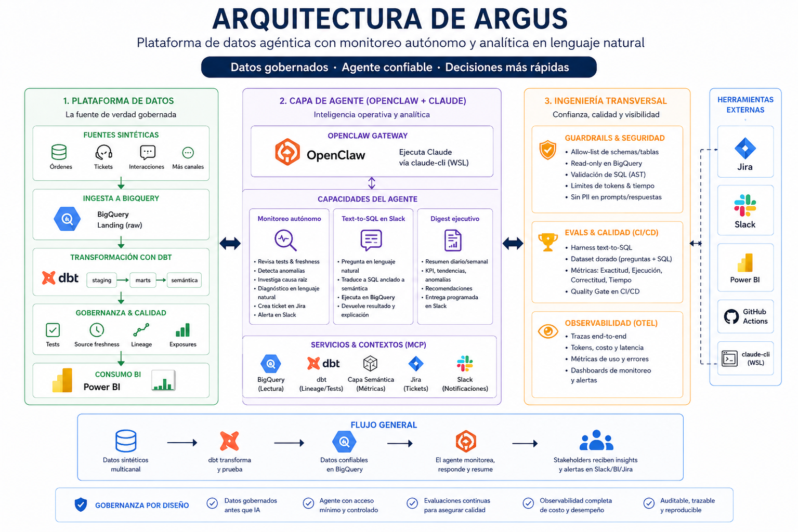

<div align="center">

# 🛰️ Argus — Agente Autónomo de Confiabilidad de Datos y Analítica

### Plataforma de datos agéntica que monitorea pipelines, se autodiagnostica ante incidentes y responde preguntas de negocio en lenguaje natural — construida sobre dbt, BigQuery, OpenClaw y Claude.

<br>


<br>

> **Proof of Concept** — Argus simula el stack de confiabilidad de datos que una empresa data-driven necesita para pasar de apagar incendios de forma *reactiva* ("¿por qué cambió este número del dashboard?") a pipelines *proactivos* que se autodiagnostican, más una capa de analítica en lenguaje natural gobernada. Todo corre sobre datos sintéticos; no se usa información real de ninguna empresa.

<br>

[🎯 Problema](#-el-problema) · [💡 Solución](#-la-solución) · [📐 Arquitectura](#-arquitectura) · [🧱 Plataforma de Datos](#-plataforma-de-datos-dbt--bigquery) · [🧮 Capa Semántica](#-capa-semántica) · [🛡️ Guardrails](#️-guardrails--seguridad) · [🤖 Text-to-SQL](#-text-to-sql) · [🚨 Monitoreo](#-monitoreo-autónomo-capacidad-1) · [📊 Digest](#-digest-ejecutivo-capacidad-3) · [🔮 Radar Predictivo](#-radar-predictivo-capacidad-4) · [🔌 OpenClaw](#-orquestación-openclaw--slack--jira) · [🧪 Evals](#-harness-de-evaluación) · [🏢 Config por Cliente](#-configuración-por-cliente) · [🚀 Quick Start](#-quick-start) · [🩺 Decisiones de Diseño](#-decisiones-de-diseño--tradeoffs) · [📁 Estructura](#-estructura-del-proyecto)

</div>

---

## 🎯 El Problema

Toda empresa que opera sobre datos choca con los mismos dos modos de falla a medida que escala:

| Síntoma | Impacto real |
|---|---|
| Los pipelines se rompen **en silencio** | Un KPI cambia y nadie sabe por qué hasta que un stakeholder se queja |
| El análisis de causa raíz es **manual** | Los analistas de guardia queman horas escribiendo queries ad-hoc |
| Los checks de calidad viven **dentro de un script** | Sin lineage, sin historial, sin gate — el dato malo llega al warehouse |
| Los analistas son un **cuello de botella** para preguntas | "¿Por qué bajaron las ventas la semana pasada?" espera en una fila |
| Los demos de LLM-sobre-SQL **alucinan joins** | Impresionan en la demo, fallan en producción |

---

## 💡 La Solución

Una plataforma de datos gobernada, con un agente encima que lee la capa *gobernada* — nunca tablas crudas:

```
Datos sintéticos multicanal  →  dbt (staging → marts + tests)  →  BigQuery
                                          │
                                 Capa semántica (métricas gobernadas)
                                          │
                                  Claude (Sonnet 5, vía API)
                                          │
                        ┌─────────────────┴─────────────────┐
                  Text-to-SQL en CLI                  Harness de evals
              (anclado a la capa semántica)       (precisión de ejecución)
```

1. **Modela** el warehouse con dbt — staging, marts, tests y freshness como ciudadanos de primera clase.
2. **Gobierna** las métricas en una capa semántica validada contra el SQL real de los modelos — no una lista de columnas mantenida a mano que se desactualiza sola.
3. **Cerca con guardrails** cualquier SQL generado antes de que toque BigQuery: solo lectura, sin PII, sin SQL apilado, con límite de filas.
4. **Responde** preguntas de negocio vía text-to-SQL, anclado a la capa semántica.
5. **Mide** la precisión del text-to-SQL con un harness de evals que compara resultados, no texto.
6. **Se configura por cliente** en un YAML — el código no cambia entre clientes con un stack similar.

---

## 📐 Arquitectura


<sub>*(reemplaza `Img_Arq.png` con tu propio diagrama antes de subir — no se generó una imagen real durante el build, el diagrama de texto de abajo es la fuente de verdad actual)*</sub>

Tres capas, cada una con una sola responsabilidad:

**Plataforma de datos (la fuente de verdad).** Un generador sintético parametrizado por cliente (`clients/*.yml`) escribe eventos multicanal a BigQuery. dbt transforma `raw → staging → marts`, con tests de datos y freshness declarada. Esta capa es determinista y totalmente testeable — el agente nunca inventa datos, lee tablas modeladas.

**Capa de agente (Claude vía API de Anthropic).** `argus/ask.py` recibe una pregunta, la ancla a la capa semántica, genera SQL, lo valida con guardrails, lo ejecuta con una cuenta de servicio de solo lectura, y devuelve una narrativa.

**Ingeniería transversal.** Guardrails, un harness de evals que actúa como gate de CI, y una capa de configuración por cliente envuelven ambas capas.

> **Estado:** las cuatro capacidades (las tres del diseño original, más el Radar Predictivo agregado después) están implementadas y verificadas con datos y credenciales reales — no solo en el papel. La orquestación también: cinco skills corren solas vía OpenClaw + cron, y los incidentes llegan de verdad a Slack y abren tickets en Jira.

---

## 🧱 Plataforma de Datos (dbt + BigQuery)

El warehouse está modelado, no volcado:

```
models/
├── staging/      un modelo por fuente (stg_orders_web/app/pos), 1:1 con raw
├── intermediate/ union de los 3 canales, ephemeral (no crea tabla física)
└── marts/        mart_orders — una fila por orden, documentado, testeado
```

Todo vive en el dataset `argus_analytics`, sin importar la capa — hay un macro (`macros/generate_schema_name.sql`) que lo fuerza así, porque el comportamiento por defecto de dbt (`+schema: staging` → dataset nuevo `analytics_staging`) habría roto el modelo de permisos: la cuenta de solo lectura del agente solo tiene acceso a `argus_analytics`, no a datasets que dbt pudiera inventar.

```yaml
# models/staging/_staging.yml
sources:
  - name: raw
    freshness:
      warn_after:  { count: 6,  period: hour }
      error_after: { count: 12, period: hour }
    loaded_at_field: _ingested_at
    tables:
      - name: raw_orders_web
      - name: raw_orders_app
      - name: raw_orders_pos
```

`dbt build` corre modelos y tests en orden de dependencias. Tests reales, no de relleno: `revenue >= 0`, `ingestion_lag_minutes >= 0`, `order_id` único, `channel`/`status` acotados a valores válidos.

---

## 🧮 Capa Semántica

`semantic/metrics.yml` define `orders`, `revenue` y `cancellation_rate` — una sola vez. El agente recibe estas definiciones como contexto de anclaje y compone SQL a partir de métricas conocidas, no de aritmética de columnas inventada.

```yaml
metrics:
  - name: cancellation_rate
    calculation: "countif(status = 'cancelled') / count(order_id)"
    table: "mart_orders"
    grain: ["order_date", "channel", "country"]
```

**La validación no es cosmética.** `argus/semantic.py` parsea el SQL *real* de `mart_orders.sql` con `sqlglot` y confirma que cada métrica y cada dimensión de `grain` referencian columnas que existen de verdad — no una lista de columnas mantenida a mano que se desactualiza sola. La primera versión de este validador tenía un bug real: leía el `select * from final` final del modelo y se quedaba con el `*` literal en vez de resolver las columnas del CTE `final`. Se detectó rompiendo el mart a propósito antes de entregar el código — ver [Decisiones de Diseño](#-decisiones-de-diseño--tradeoffs).

---

## 🛡️ Guardrails & Seguridad

El agente habla con BigQuery a través de una cuenta de servicio **de solo lectura** (`sa-agent`), separada de la que carga datos (`sa-loader`) desde la Fase 0. Cada query generada se valida *antes* de ejecutarse:

```python
# argus/guardrails/sql.py
BLOCKED_STATEMENT_TYPES = (exp.Insert, exp.Update, exp.Delete, exp.Drop, exp.Create, exp.Alter, exp.Merge)

def validate(sql: str, max_rows: int = 10_000, ...) -> str:
    statements = [s for s in sqlglot.parse(sql, read="bigquery") if s is not None]
    if len(statements) > 1:
        raise GuardrailViolation("SQL apilado no permitido.")   # ver nota abajo
    ...
```

Defensa en profundidad:

- **IAM de solo lectura** — el control primario. `sa-agent` no *puede* escribir, sin importar qué SQL genere.
- **Solo `SELECT`, sin `SELECT *`** — columnas nombradas explícitamente.
- **Rechazo de SQL apilado** — `sqlglot.parse_one()` descarta en silencio cualquier sentencia después de un `;`; un ataque tipo `SELECT ...; DROP TABLE ...;` se vería "limpio" si solo se mirara la primera. Este proyecto usa `sqlglot.parse()` (plural) y exige exactamente una sentencia. Encontrado probando casos adversarios antes de escribir los tests, no después de un incidente.
- **Columnas PII bloqueadas** — lista explícita, inglés + español, coincidencia exacta sobre nombre normalizado (no heurística difusa: en seguridad, predecible le gana a "inteligente").
- **`LIMIT` forzado y acotado** — un `LIMIT` ausente se agrega; uno que excede el máximo se recorta. Ninguno de los dos puede saltarse el cap de filas.
- **Cap de bytes facturados** — `maximum_bytes_billed` a nivel de job de BigQuery; una query mala no puede escanear (ni facturar) el warehouse completo.

---

## 🤖 Text-to-SQL

```bash
$ python -m argus.ask "¿cuántas órdenes hubo en total por canal?" --show-sql

SQL generado:
SELECT channel, COUNT(order_id) AS orders
FROM `argus-data-agent.argus_analytics.mart_orders`
GROUP BY channel

channel  orders
    pos   39503
    app   87303
    web  131325

El canal web concentra la mayor parte de las órdenes con 131,325 (~51% del
total), seguido de app con 87,303 (34%) y pos con 39,503 (15%)...
```

Flujo (`argus/ask.py`): pregunta → `generate_sql()` (Claude + contexto semántico) → `validate()` (guardrails) → `run_query()` (BigQuery, cuenta de solo lectura) → `generate_narrative()` (Claude, español). Construido primero como CLI a propósito — cualquier transporte futuro (Slack, etc.) llamaría a estas mismas funciones.

### Modo escenario — "¿qué pasaría si...?" (`argus/scenario.py`)

Extensión de la Capacidad 2. Claude nunca calcula el resultado — solo parsea la pregunta a una perturbación estructurada (validada contra la capa semántica) y narra un número ya calculado con aritmética determinista. Cuando el cálculo requiere un supuesto (ej. "las órdenes recuperadas generan el ingreso promedio actual"), ese supuesto se **imprime siempre**, nunca se esconde detrás de la cifra:

```bash
$ python -m argus.scenario "¿qué pasaría con los ingresos si la cancelación bajara a 6%?"

Ingresos actual:     3,552,202.96
Ingresos proyectado: 3,655,850.52 (+2.9%)
Fórmula: tasa actual 8.7% -> objetivo 6.0% sobre 86405 órdenes = 2303 órdenes recuperadas
Supuesto: cada orden recuperadas genera el ingreso promedio de una orden completada actual ($45.01)

Si la tasa de cancelación bajara del 8.7% actual a 6.0%, se recuperarían
alrededor de 2,303 órdenes que hoy se están cancelando... Es importante
aclarar que este cálculo asume que cada orden recuperada generaría un
ingreso igual al promedio actual — un supuesto razonable para estimar el
impacto, pero no un dato medido directamente.
```

---

## 🚨 Monitoreo Autónomo (Capacidad 1)

Un monitor que corre checks de calidad sobre `mart_pipeline_health` (volumen, frescura, tasa de nulos — z-score contra un baseline de 7 días, no umbrales fijos adivinados) y, cuando algo falla, le pide a Claude un diagnóstico en lenguaje llano:

```
======================================================================
[ERROR] freshness — canal 'web'
======================================================================
'web' no recibe datos hace 22.9h (umbral error: 12h)

Detectado:  El canal 'web' no recibe datos desde hace 22.9h, superando el
            umbral de error (12h).
Diagnóstico: causa no determinada desde los datos disponibles; puede
            tratarse de un corte en el pipeline de ingesta, un fallo en
            la fuente origen, o un problema de scheduling del job.
Acción:     Revisar el estado del job/pipeline de ingesta (logs,
            orquestador) y confirmar si la fuente origen está emitiendo.
======================================================================
```

Nótese lo que el diagnóstico **no** hace: no inventa una causa específica que los datos no sustentan. El prompt lo instruye explícitamente a decir "causa no determinada" en vez de adivinar — verificado con datos reales, no solo prometido en el prompt.

**Notificación desacoplada a propósito.** `argus/notifiers.py` define un `Protocol` con cuatro implementaciones: `ConsoleNotifier`, `SlackNotifier`, `JiraNotifier`, y `MultiNotifier` (fan-out a varios a la vez — regla de éxito parcial: si al menos uno funciona, no se repite spam en el siguiente cron aunque el otro haya fallado). Ver [Decisiones de Diseño](#-decisiones-de-diseño--tradeoffs) para por qué `mart_pipeline_health` existe en vez de darle a `sa-agent` acceso a `argus_raw`.

**Investigación multi-paso antes de diagnosticar (`argus/monitors/investigate.py`).** Para `volume_drop`, corre un desglose determinista por país (hoy vs. baseline de 7 días) antes de pedirle a Claude el diagnóstico — así, en vez de "causa no determinada" genérico, el modelo recibe un patrón real (`"concentrada en 1 de 4 países: MX"` o `"generalizada"`) del cual partir.

```bash
python -m argus.monitors.run
```

### Alerta de presupuesto — el monitor se vigila a sí mismo

Un check más (`check_budget()`), que no toca BigQuery — lee el log local de costo (`argus/observability.py`, ver [Radar Predictivo](#-radar-predictivo-capacidad-4)) y compara el gasto de Claude de las últimas 24h contra un umbral (`warn` a $1, `error` a $5). Reutiliza el mismo `Finding`/`Notifier`/dedup que los demás checks — si el agente empieza a gastar de más, se entera por el mismo canal que cualquier otro incidente.

---

## 📊 Digest Ejecutivo (Capacidad 3)

Un brief periódico que calcula las métricas gobernadas para la semana más reciente vs. la anterior — anclado a la **fecha más reciente que existe en los datos**, no al calendario real (los datos son un snapshot generado una vez, no un pipeline vivo; anclar a "hoy" produciría comparaciones contra semanas vacías).

Diferencia de arquitectura con la Capacidad 2: aquí el SQL sale directo de `calculation` en la capa semántica — determinista, sin pasar por un LLM. Claude solo escribe la narrativa a partir de números ya calculados, nunca decide qué calcular; un digest programado necesita el mismo número cada vez que corre sobre los mismos datos.

```
📊 Digest ejecutivo — semana terminando 2026-07-15

- Órdenes: 20046.00 (semana previa: 19984.00, cambio: +0.3%)
- Ingresos: 902193.82 (semana previa: 899061.01, cambio: +0.3%)
- Tasa de cancelación: 0.08 (semana previa: 0.08, cambio: -3.7%)

Las métricas principales se mantuvieron estables esta semana... no se
observan variaciones significativas que requieran atención inmediata.
```

```bash
python -m argus.digest
```

---

## 🔮 Radar Predictivo (Capacidad 4)

La cuarta capacidad, agregada después de que las primeras tres ya estaban verificadas con datos reales — cierra el arco narrativo del proyecto: Capacidad 1 responde *qué pasó*, Capacidad 3 *qué está pasando*, esto responde *qué va a pasar si nada cambia*, y el [modo escenario](#-text-to-sql) *qué pasaría si algo cambiara, a pedido*.

**Mismo principio de todo el proyecto, aplicado de nuevo: Claude nunca calcula el número.**

### Pronóstico determinista (`argus/forecast.py`)

Ajusta tendencia + estacionalidad de día-de-semana **en una sola regresión conjunta** (no en dos pasos separados — ver la nota de bug abajo) sobre la serie histórica de cada métrica gobernada, y proyecta 7 días adelante. Sin librerías de ML nuevas — `numpy` puro, coherente con la decisión ya tomada en la Fase 7 de quedarse con detección estadística en vez de basada en modelo.

```bash
$ python -m argus.report   # el pronóstico alimenta el reporte diario

⚠️ 1 señal de riesgo — Tasa de cancelación
La tasa de cancelación está proyectada a cruzar el umbral crítico de
0.12 en ~7 días (2026-07-26).
```

Verificado dos veces con datos reales: una vez con `cancellation_rate` estable (0 señales, correcto — no hay nada que reportar), y una vez inyectando la falla `kpi_anomaly` (spike real del 5x en un día), donde `at_risk` sí se disparó con el detalle correcto.

### Investigación multi-paso (`argus/monitors/investigate.py`)

Ver [Monitoreo Autónomo](#-monitoreo-autónomo-capacidad-1) — el desglose por país que enriquece el diagnóstico de `volume_drop` antes de que Claude lo vea.

### Reporte diario (`argus/report.py`)

Combina pronóstico + incidentes ya investigados en un HTML (`reports/report_<fecha>.html`) más una narrativa. **Degrada con gracia sin Claude** — probado explícitamente: sin `ANTHROPIC_API_KEY`, usa una plantilla determinista en vez de fallar por completo (mismo patrón que se extendió después a `digest.py` y `monitors/run.py`, ver [Decisiones de Diseño](#-decisiones-de-diseño--tradeoffs)).

```bash
python -m argus.report
```

---

## 🔌 Orquestación: OpenClaw + Slack + Jira

Nada se corre a mano — cinco **skills** de OpenClaw, programadas con **cron**, notifican de verdad:

| Skill | Cron | Qué hace |
|---|---|---|
| `argus-ask` | (a pedido, vía chat) | Text-to-SQL conversacional (Capacidad 2) |
| `argus-monitor` | cada 4h | Checks de calidad + diagnóstico (Capacidad 1) |
| `argus-report` | diario, 7am | Radar predictivo (Capacidad 4) |
| `argus-digest` | semanal, lunes 8am | Brief ejecutivo (Capacidad 3) |
| `argus-incremental-load` | diario, 5am | Mantiene el freshness genuinamente vivo (ver abajo) |

```
→ Notificando a Slack (#data-quality-alerts)
→ Abriendo tickets en Jira (SCRUM)
→ 3 incidente(s) detectado(s) y notificado(s).
```

Resultado real: tickets abiertos automáticamente (`SCRUM-88/89/90` y sucesivos), con el mismo diagnóstico que llegó a Slack — el diseño original ("abre un ticket en Jira y avisa en Slack") funcionando literal, no como aspiración.

### Carga incremental — el freshness deja de envejecer congelado

Los datos del PoC son un snapshot generado una vez (`data.synthetic.generate_data`), no un pipeline vivo — así que el check de freshness envejecía sin límite mientras pasaban las horas reales. `data/synthetic/incremental_load.py` genera **un solo día** y lo **agrega** (`WRITE_APPEND`, no `WRITE_TRUNCATE`) a las tablas raw cada madrugada, para que el monitor vigile algo genuinamente vivo.

```bash
python -m data.synthetic.incremental_load          # agrega el día de "ayer"
```

**Decisiones de arquitectura de esta fase:**

- **`SlackNotifier` y `JiraNotifier` son Python puro, no un servidor MCP.** El plan original mencionaba MCP para Jira, pero para "publicar un mensaje" o "abrir un ticket" por incidente, una llamada REST directa (`chat.postMessage`, `POST /rest/api/2/issue`) es más simple y no depende de infraestructura adicional de OpenClaw. MCP tendría sentido si el *agente conversacional* necesitara crear tickets a pedido — un caso distinto al de un monitor automático.
- **Jira API v2, no v3.** v3 exige que `description` venga en Atlassian Document Format (JSON anidado); v2 acepta texto plano, que es todo lo que este notifier necesita.
- **`MultiNotifier` con éxito parcial.** Si Jira falla pero Slack funciona (o viceversa), no se lanza excepción — solo se advierte. Lanzar la excepción completa haría que el incidente nunca se marque como "notificado", y el canal que sí funcionó recibiría el mismo mensaje duplicado en el siguiente cron.
- **Deduplicación de incidentes (`argus/monitors/state.py`).** Sin esto, el cron de 4h reenviaría la misma alerta de freshness indefinidamente mientras los datos sigan congelados. Un incidente no se repite dentro de 24h a menos que empeore (`warn` → `error`).
- **`generate_channel_orders` (historia completa) y `generate_single_day` (incremental) usan esquemas de seed deliberadamente distintos.** El primero resetea su generador aleatorio en cada llamada, a propósito, para que el bloque histórico completo sea siempre idéntico (clave para los evals). El segundo necesita justo lo contrario — que cada día calendario real produzca datos distintos al anterior — así que el seed incorpora la fecha real.
- **Bug real encontrado: `hash()` nativo de Python está randomizado por proceso.** El generador usaba `hash(channel)` para sembrar su generador aleatorio — funciona igual dentro de una misma ejecución (por eso los tests originales no lo atraparon), pero da un valor *distinto en cada proceso de Python* (protección de seguridad desde la 3.3, activa por default). Esto rompía la promesa de "mismo seed = mismo resultado" entre corridas separadas del script — se encontró comparando `--dry-run` contra una carga real del mismo día, con conteos que no coincidían. Se corrigió con `zlib.crc32()` (estable entre procesos) y se agregó un test que invoca el CLI como dos procesos de Python completamente separados y compara la salida byte por byte — el único tipo de test que atrapa esta clase de bug.
- **Se encontró y corrigió un bug real de OpenClaw** durante esta fase: un bloqueo circular en el flujo de aprobación de permisos (`scope upgrade pending approval`), documentado en su repositorio. Se resolvió actualizando de `2026.6.11` a `2026.7.1`.

---

## 🧪 Harness de Evaluación

Evaluado por **precisión de ejecución** (¿coinciden los result sets?), no por coincidencia de texto de SQL — dos queries distintas pueden ser igualmente correctas.

```yaml
# argus/evals/cases.yml
- id: cancellation_rate_overall
  question: "¿Cuál es la tasa de cancelación general, como proporción?"
  reference_sql: "references/cancellation_rate_overall.sql"
```

Las 6 queries de referencia semilla se verificaron dos veces antes de confiar en ellas: sintaxis con `sqlglot`, y lógica recalculando los mismos agregados con `pandas` directo desde el generador determinista (mismo seed que los datos reales), de forma independiente a BigQuery.

> **Precisión de evals (corrida real, 16 jul 2026):** **6/6 (100%)** sobre la suite semilla.
> Nota honesta: `n=6` es una muestra pequeña — suficiente para probar que el mecanismo de comparación funciona, no una garantía estadística. Ampliar la cobertura es trabajo de roadmap, no un hueco oculto.

El runner clasifica cada falla por tipo (`result_mismatch`, `guardrail_rejected`, `invalid_sql`, `generation_error`, `reference_query_failed`) para que un fallo diga *por qué*, no solo *que* falló. Gate obligatorio de CI (`--min-accuracy 0.90`).

> **Costo real medido (instrumentado en Fase 10, `argus/observability.py`):** **~$0.0034 por pregunta** de `ask` (2 llamadas a Claude: generar SQL + narrativa) y **~$0.0030 por corrida** de `digest` (1 sola llamada — el SQL sale directo de la capa semántica, sin pasar por Claude, confirmado por el propio conteo de llamadas). Sonnet 5 cuesta $2/$10 por millón de tokens de entrada/salida (precio introductorio vigente a jul-2026). `python -m argus.observability` genera este reporte en cualquier momento, agregado por componente.

---

## 🏢 Configuración por Cliente

Canales, países, mezclas y volúmenes del generador **no** están en el código — viven en `clients/<nombre>.yml`, validados con `pydantic` (los pesos de país/status deben sumar 1.0, o falla temprano con un mensaje claro).

```yaml
# clients/example.yml
channels:
  web: { base_volume: 1400, weekend_multiplier: 1.15 }
  app: { base_volume: 900,  weekend_multiplier: 1.25 }
  pos: { base_volume: 500,  weekend_multiplier: 0.6 }
countries: { MX: 0.45, US: 0.30, CO: 0.15, ES: 0.10 }
```

Para un cliente nuevo con un stack similar: se escribe un YAML nuevo, el Python no se toca. Verificado generando datos completos para un cliente ficticio (`acme-corp`, canal `marketplace`, países BR/AR) sin editar una sola línea de código.

---

## 🚀 Quick Start

### Prerrequisitos

```bash
Python 3.12 (NO 3.14 -- protobuf/dbt no compilan ahí, ver nota abajo)
Un proyecto de BigQuery + dos service accounts (sa-loader, sa-agent) -- ver docs/setup-gcp.md
Una API key de Anthropic -- console.anthropic.com/settings/keys
```

> **Nota de compatibilidad:** este proyecto se desarrolló y probó contra un entorno con Python 3.14 preinstalado, donde `protobuf` (dependencia de dbt y de google-cloud-bigquery) falla al compilar con `TypeError: Metaclasses with custom tp_new are not supported`. La solución fue crear el entorno virtual con Python 3.12 explícito (`python3.12 -m venv .venv`). Si `dbt --version` o `import google.protobuf` fallan con ese error, es esto.

### Setup

```bash
cp .env.example .env      # GCP_PROJECT_ID, rutas a llaves, ANTHROPIC_API_KEY
mkdir -p ~/.dbt && cp profiles.example.yml ~/.dbt/profiles.yml
python3.12 -m venv .venv && source .venv/bin/activate
pip install -r requirements.txt
python -m scripts.bootstrap_bq       # crea datasets, verifica permisos IAM
```

### Generar datos y construir el warehouse

```bash
python -m data.synthetic.generate_data --days 90     # ~258k filas sintéticas
set -a && source .env && set +a                       # exporta env vars para dbt
dbt deps && dbt build
```

### Usar el agente

```bash
python -m argus.ask "¿qué canal generó más ingresos?" --show-sql
python -m argus.scenario "¿qué pasaría con los ingresos si subieran 10%?"
python -m argus.monitors.run                            # checks + diagnóstico + notificación
python -m argus.report                                  # pronóstico + investigación (Capacidad 4)
python -m argus.digest                                  # brief ejecutivo semanal
python -m argus.evals.run                                # harness completo
python -m argus.observability                             # reporte de costo real
```

---

## 🩺 Decisiones de Diseño & Tradeoffs

*Lo senior no es la lista de features — es por qué cada pieza está construida como está, y qué se rompió en el camino.*

- **`generate_schema_name` sobreescrito para forzar un solo dataset.** El comportamiento por defecto de dbt con `+schema: staging` crea datasets nuevos (`argus_analytics_staging`). El permiso de lectura de `sa-agent` (Fase 0) está scopeado a `argus_analytics` únicamente — sin el override, dbt habría creado infraestructura fuera de ese permiso sin que nadie lo notara hasta que el agente intentara leer ahí.

- **Validación de la capa semántica contra el SQL real, con un bug real encontrado en el camino.** La primera versión de `_output_columns()` leía el `select * from final` de cierre de cada modelo y se quedaba con el `*` literal — resultado: **todo pasaba, incluso lo que no debía**, el peor tipo de bug en un validador. Se encontró corriendo la suite antes de entregar, se arregló para resolver la cadena de CTEs, y se confirmó rompiendo el mart a propósito (un typo deliberado en `revenue`) para probar que el test de verdad lo atrapa.

- **Guardrails que rechazan SQL apilado explícitamente.** `sqlglot.parse_one()` descarta en silencio todo después de un `;`. Confiar en eso habría dejado un hueco de seguridad real (`SELECT ...; DROP TABLE ...;` se vería limpio). Se encontró probando el caso adversario *antes* de escribir el resto del validador, no después.

- **`create_bqstorage_client=False` en el ejecutor de queries.** El camino "rápido" de BigQuery requiere `bigquery.readsessions.create` a nivel de *proyecto* — un permiso que no se puede acotar a un dataset como sí se hizo con `dataViewer`. Con `SQL_MAX_ROWS` topando el tamaño del resultado, la velocidad extra es irrelevante; mantener a `sa-agent` sin permisos de proyecto no lo es.

- **Precisión de ejecución, no coincidencia de string, como métrica de eval.** Dos queries distintas pueden ser igualmente correctas. Se sigue evaluando si los *result sets* coinciden, normalizando orden de filas/columnas antes de comparar.

- **Configuración por cliente desde la Fase 1, no como refactor tardío.** Canales/países/volúmenes en YAML en vez de constantes en Python — la pregunta de qué tan fácil sería replicar este proyecto para un cliente real llevó a esta decisión antes de que hiciera falta, no después.

- **Solo lectura por construcción, no por política.** La capa de guardrails es real, pero el control primario es que el rol IAM del agente *no puede* escribir.

- **Pronóstico con regresión conjunta, no en dos pasos.** La primera versión de `argus/forecast.py` ajustaba tendencia lineal y *después* promediaba residuales por día de la semana — se encontró probando con una serie sintética de estacionalidad **conocida** (fines de semana +50, sin tendencia real) que ese método en dos pasos generaba una pendiente falsa cuando la ventana de historia no tenía los fines de semana perfectamente centrados. Se corrigió con una sola regresión (tendencia + 7 niveles de día de semana simultáneos), verificado con la misma serie sintética dando `slope ≈ 0` exacto.

- **El modo escenario nunca esconde sus supuestos.** Cuando un cálculo requiere una suposición no medida (ej. "las órdenes recuperadas generan el ingreso promedio actual"), esa suposición se imprime siempre junto al resultado, y Claude la repite explícitamente en su narrativa — un número proyectado nunca se presenta como si fuera un hecho medido.

- **Degradación elegante consistente, pero no uniforme.** `report.py`, `digest.py` y `monitors/run.py` funcionan sin `ANTHROPIC_API_KEY` (plantilla determinista en vez de fallar). `ask.py` y `scenario.py` **sí** bloquean sin la llave, a propósito — estructuralmente no hay nada que degradar cuando la tarea central *es* traducir lenguaje natural a una estructura, no narrar un número ya calculado.

- **Bug real de `hash()` randomizado entre procesos, encontrado por accidente productivo.** El generador de datos sembraba su generador aleatorio con `hash(channel)` — estable dentro de un proceso (por eso ningún test lo atrapó), pero distinto en cada ejecución del script (protección de seguridad de Python desde la 3.3). Se descubrió comparando la salida de `--dry-run` contra una carga real del mismo día: los conteos no coincidían, y deberían haber sido idénticos. Corregido con `zlib.crc32()`, con un test que corre el CLI como dos procesos de Python separados para probarlo al nivel donde el bug realmente vivía.

---

## ⚠️ Limitaciones Conocidas

- Corre sobre **datos sintéticos**; las distribuciones son plausibles pero no reales.
- El **tier sandbox de BigQuery** tiene límite de retención de 60 días y restricciones de DML (que este proyecto no necesita — ver `docs/setup-gcp.md`).
- Solo se generan 3 canales (web/app/pos), no los 6 originalmente contemplados (email/chat/social quedan fuera de alcance de este PoC).
- El CI corre `dbt build` + evals contra el **mismo** dataset `argus_analytics` de desarrollo local, no uno aislado — ver la nota en `.github/workflows/ci.yml`.
- El diagnóstico de `freshness` sigue siendo una sola llamada a Claude — la investigación multi-paso (`argus/monitors/investigate.py`) solo está definida para `volume_drop` y `null_spike` (desglose por país). Freshness no tiene un desglose útil que investigar: si un canal no recibe datos en absoluto, no hay filas que desglosar.
- Deduplicación de incidentes basada en un archivo JSON local (`state/monitor_state.json`), no en una base de datos — suficiente para un solo proceso/máquina, no pensado para múltiples workers en paralelo.
- Observabilidad de costo vía JSONL local (`state/usage_log.jsonl`), no OpenTelemetry — mismo criterio de alcance: suficiente para un proceso/máquina, no para un sistema distribuido.
- El modo escenario soporta dos tipos de perturbación (escalar una métrica, o mover la tasa de cancelación a un objetivo) — no es un motor de simulación de negocio de propósito general.
- La carga incremental diaria agrega datos sintéticos nuevos, no una fuente de datos real — mantiene el freshness genuinamente vivo, pero sigue siendo un PoC sobre datos generados, no un pipeline productivo.

---

## 📦 Tech Stack

| Capa | Tecnología | Propósito |
|---|---|---|
| Lenguaje | Python 3.12 | Generadores, agente, evals, guardrails |
| Warehouse | Google BigQuery | Warehouse en la nube (sandbox) |
| Transformación | dbt-core 1.8 | Modelos, tests, freshness, lineage |
| Razonamiento | Claude Sonnet 5 (API de Anthropic) | Text-to-SQL, narrativa, diagnóstico |
| Orquestación | OpenClaw 2026.7 | Skills + cron para correr el monitor/digest solos |
| Notificaciones | Slack (Web API) | Alertas de incidentes en tiempo real |
| Ticketing | Jira (REST API v2) | Tickets de incidente abiertos automáticamente |
| Validación de config | pydantic v2 | Config por cliente, capa semántica |
| Guardrails de SQL | sqlglot | Parsea/valida cada query generada |
| CI/CD | GitHub Actions | Lint + dbt build + gate de evals en cada PR |

---

## 🔁 CI/CD

Dos jobs: `lint` (ruff + pytest, sin red real) y `build_and_eval` (dbt build + harness de evals, gate en `--min-accuracy 0.90`), que corre solo si `lint` pasa.

```yaml
build_and_eval:
  needs: lint
  steps:
    - run: dbt build
    - run: python -m argus.evals.run --min-accuracy 0.90
```

Requiere 3 GitHub Secrets: `SA_LOADER_KEY_JSON`, `SA_AGENT_KEY_JSON`, `ANTHROPIC_API_KEY`.

---

## 📁 Estructura del Proyecto

```
argus-data-agent/
│
├── 📄 .env.example · docker-compose.yaml · Dockerfile · Makefile
├── 📄 dbt_project.yml · packages.yml · profiles.example.yml
│
├── 📂 docs/
│   └── setup-gcp.md                  ← dos service accounts, permisos IAM
│
├── 📂 data/synthetic/
│   ├── generate_data.py              ← generador multicanal, --inject-fault, historia completa
│   └── incremental_load.py           ← agrega un día por vez (WRITE_APPEND), mantiene freshness vivo
│
├── 📂 clients/
│   └── example.yml                   ← config por cliente (canales, países, mezclas)
│
├── 📂 models/                        ← dbt: staging → intermediate → marts
├── 📂 macros/
│   └── generate_schema_name.sql      ← fuerza un solo dataset
│
├── 📂 semantic/
│   └── metrics.yml                   ← métricas gobernadas
│
├── 📂 argus/
│   ├── config.py · clients.py        ← settings, credenciales por rol
│   ├── client_config.py              ← loader/validador de clients/*.yml
│   ├── semantic.py                   ← loader/validador de metrics.yml
│   ├── warehouse.py                  ← único punto de acceso a BigQuery
│   ├── ask.py                        ← text-to-SQL (CLI, Capacidad 2)
│   ├── scenario.py                   ← modo "qué pasaría si...?" (extiende Capacidad 2)
│   ├── digest.py                     ← digest ejecutivo (Capacidad 3)
│   ├── forecast.py                   ← pronóstico determinista (Capacidad 4)
│   ├── report.py                     ← reporte diario: pronóstico + investigación (Capacidad 4)
│   ├── notifiers.py                  ← Notifier Protocol: Console/Slack/Jira/Multi
│   ├── observability.py              ← tokens/costo por llamada + reporte agregado
│   ├── guardrails/sql.py             ← validador de SQL
│   ├── monitors/
│   │   ├── checks.py                 ← freshness/volumen/nulls/budget (Capacidad 1)
│   │   ├── investigate.py            ← desglose por país antes del diagnóstico
│   │   ├── state.py                  ← deduplicación de incidentes (cooldown 24h)
│   │   └── run.py                    ← orquestador: checks → investigar → diagnóstico → notify
│   └── evals/
│       ├── cases.yml · references/*.sql
│       └── run.py                    ← scorer de precisión de ejecución
│
├── 📂 reports/                        ← reportes diarios generados (.html, no versionado)
├── 📂 state/                          ← estado local de runtime (no versionado)
│
├── 📂 tests/                          ← 227 tests, sin llamadas reales a red
│
└── 📂 .github/workflows/
    └── ci.yml                        ← lint + dbt build + gate de evals
```

---

## 🗺️ Roadmap

```
✅ Fase 0-1   ▸  Cimientos, IAM, generador sintético + config por cliente
✅ Fase 2-3   ▸  Modelos dbt + capa semántica validada
✅ Fase 4-5   ▸  Guardrails + text-to-SQL funcionando con datos reales
✅ Fase 6     ▸  Harness de evals: 6/6 (100%) + gate de CI activo
✅ Fase 7     ▸  Monitoreo autónomo (Capacidad 1): freshness/volumen/nulls + diagnóstico
✅ Fase 9     ▸  Digest ejecutivo (Capacidad 3)
✅ Fase 8     ▸  OpenClaw: 5 skills + 4 crons + SlackNotifier + JiraNotifier, todo real
✅ Fase 10    ▸  Observabilidad de costo: $0.0034/pregunta medido, no estimado
✅ Capacidad 4 ▸ Radar predictivo: pronóstico + investigación multi-paso + reporte diario
✅ Extras     ▸  Modo escenario, alerta de presupuesto, carga incremental (freshness vivo)

Próximo   ▸  Notifiers adicionales (Teams, PagerDuty) sobre el mismo Protocol
          ▸  Investigación multi-paso extendida a más tipos de check

Futuro    ▸  Ampliar cobertura de evals más allá de 6 casos semilla
          ▸  Aislar CI en su propio dataset (argus_ci) con fixtures propias
          ▸  Deduplicación de incidentes en una tabla en vez de un JSON local
          ▸  Soporte multi-warehouse (Snowflake/DuckDB)
```

---

## 📄 Licencia

MIT License — libre para uso educativo y de portafolio.

---

<div align="center">

**Desarrollado como Proof of Concept de confiabilidad de datos autónoma y analítica self-service.**

*Utiliza datos completamente sintéticos generados para fines demostrativos. No contiene información real de ninguna empresa.*

<br>

[](https://linkedin.com/in/cesar-rabago-perez)
[](https://github.com/cesarrabago)

</div>
